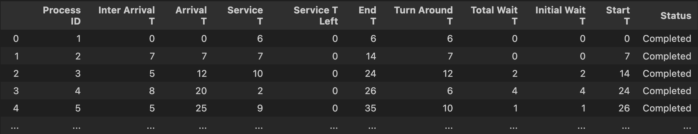

# Round Robin Gantt Chart Generator

## Overview

This project simulates the **Round Robin (RR) scheduling algorithm** for process scheduling in operating systems. It generates a Gantt chart and detailed statistics for a set of processes with configurable arrival and service times. The simulation is implemented in Python using Jupyter Notebook.

## What is Round Robin Scheduling?

Round Robin is a pre-emptive CPU scheduling algorithm widely used in time-sharing systems. Each process is assigned a fixed time slot (quantum) in a cyclic order. If a process does not finish execution within its quantum, it is placed at the end of the queue and the CPU scheduler moves to the next process. This ensures fairness and reduces starvation, making it suitable for systems where response time is important.

**Key Features:**
- Each process gets an equal share of CPU time.
- Context switching occurs after each quantum or when a process finishes.
- Suitable for interactive and real-time systems.

## Project Features

- **Simulates RR scheduling** for a list of processes with user-defined arrival and service times.
- Supports different quantum and context switch values.
- Calculates and displays:
  - Start time
  - End time
  - Initial wait time
  - Total wait time
  - Turnaround time
- Generates a Gantt chart-like output showing process execution order and timing.
- Handles both fixed and randomly generated process data.

## How It Works

1. **Initialization**:  
   - Processes are defined with their IDs, arrival times, and service times.
   - The quantum and context switch time are set.

2. **Queues**:  
   - `ready_queue`: Holds processes that have arrived but are not yet in service.
   - `service_queue`: Holds processes currently being serviced in RR order.

3. **Simulation Loop**:  
   - At each time step, processes that have arrived are moved to the ready queue.
   - The process at the front of the service queue is given CPU time for one quantum or until it finishes.
   - If not finished, it is moved to the back of the queue; otherwise, it is marked as completed.
   - The simulation continues until all processes are completed.

4. **Calculations**:  
   - **Start Time**: When a process first receives CPU time.
   - **End Time**: When a process completes execution.
   - **Initial Wait Time**: Start time minus arrival time.
   - **Total Wait Time**: Turnaround time minus service time.
   - **Turnaround Time**: End time minus arrival time.

5. **Output**:  
   - The results are displayed in a table and as a Gantt chart.
   - Average statistics (turnaround, wait, service, and interarrival times) are also calculated.

## Main Functions

- `update_ready_queue()`: Moves processes that have arrived to the ready queue.
- `service_service_queue()`: Simulates the servicing of processes according to RR logic, updating all relevant statistics.
- `generate_rand_arrival_times()`: Generates random inter-arrival and arrival times for processes.
- `generate_service_times()`: Generates random service times for processes.

## Example Output

## Usage

1. Open the Jupyter Notebook `RR_GanttChartt.ipynb`.
2. Set the desired quantum, context switch, and process data.
3. Run all cells to simulate and view the results.

---

**Author:** Marcos Hernandez  
**Course:** Operating Systems  